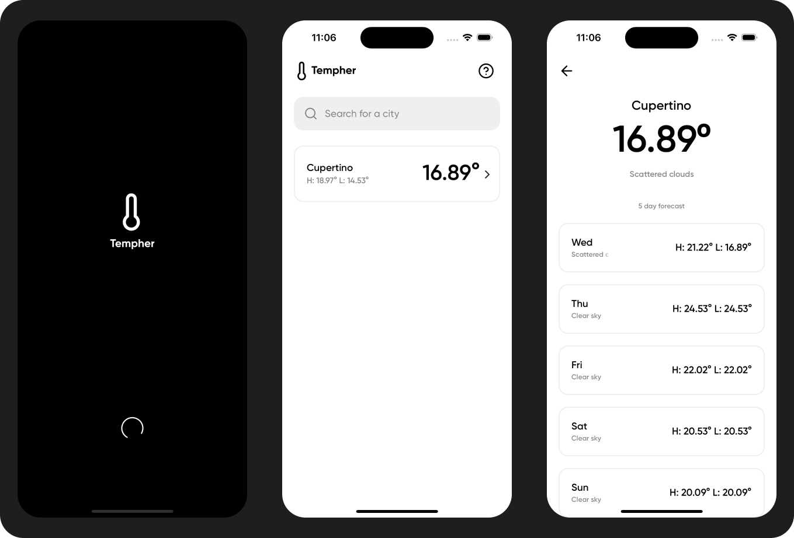

# Tempher

Tempher is a simple application with a clean and pleasant interface, designed to check the temperature and weather forecast for the next 5 days.

## Architecture

The app follows the principles of clean architecture and SOLID, utilizing the BLoC pattern for state management.

## How to Run the App

To run the app, follow the steps below:

1. Make sure you have Flutter installed on your machine. You can find detailed installation instructions at [flutter.dev](https://flutter.dev).
2. Clone the Tempher app repository.
3. Open a terminal in the project's root folder.
4. Run the command `flutter pub get` to install all project dependencies.
5. Connect a physical device or start an emulator.
6. Run the command `flutter run` to start the app.

This will launch the app on the connected device or selected emulator. Now you can explore the temperature search and weather forecast features.

## Available Languages

Tempher is available in three languages: Portuguese, English, and Spanish. You can switch between languages in the operating system settings.
